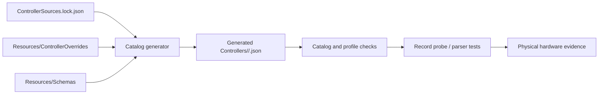

# Controller data ownership

The catalog is a generated product surface. Keep authored evidence and runtime
records on opposite sides of one deterministic generator boundary.

## Authored inputs

- `ControllerSources.lock.json` fixes the exact upstream revision and source
  hash. Moving branches are not runtime inputs.
- `Resources/ControllerOverrides/<vid>/<vid>-<pid>.json` contains complete
  `add` records or narrow `patch` operations. Adds cannot collide with upstream;
  patches require an upstream record and local evidence.
- `Resources/Schemas/` owns record shape. Use decimal numbers in committed JSON
  and preserve canonical lowercase VID/PID paths.
- Parser and transport code under `Sources/OpenJoystickDriverKit/Protocol/`
  owns shared behavior. Data records state factual device deviations only.

## Generated output and proof classes

`Sources/OpenJoystickDriverKit/Resources/Controllers/` is regenerated by the
catalog route. A clean regeneration proves deterministic catalog production and
schema/profile validity; it does not prove macOS permissions, physical input,
reconnect, rumble, LEDs, or every control. Keep these evidence classes separate:

| Class | Establishes | Does not establish |
| --- | --- | --- |
| Source-backed | upstream identity and driver classification | macOS device-open or hardware behavior |
| Packet/parser-backed | parser mapping for supplied reports | physical descriptors, reconnect, permissions |
| Record-probe-backed | candidate record opens/decodes in the probe | all controls, output actuators, consumer support |
| Hardware-verified | observed physical input/output/reconnect evidence | unrelated OS versions or other models |

Controller records contain operational facts only. Keep source revisions in
`ControllerSources.lock.json` and record evidence status in testing documents,
issues, and Git history. Never promote support status from a generated diff alone.
