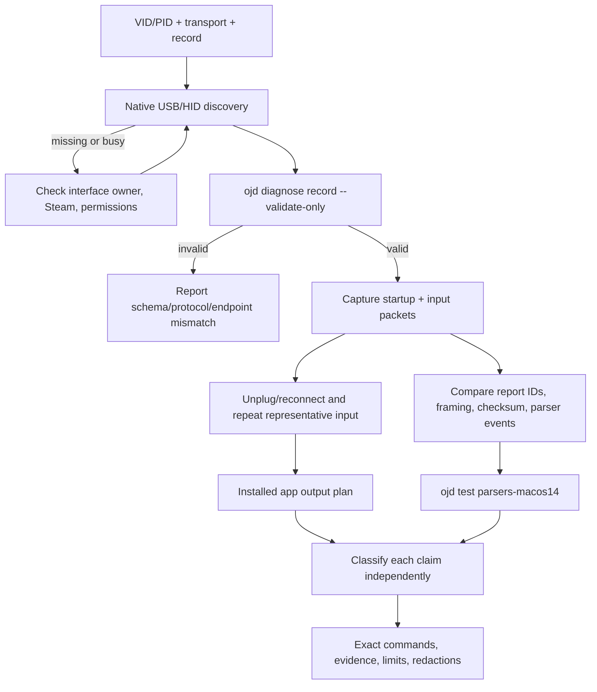

# Controller diagnosis and evidence

Use this reference with `$debug-controller-openjoystickdriver`. It is a
runbook, not a catalog-authoring or parser-implementation contract. The
canonical project procedures are `docs/testing/controller-record.md`,
`docs/testing/physical-output.md`, and the device-specific procedures under
`docs/testing/`.

## Diagnosis flow



The flow deliberately separates fixture/parser results from physical results.
A green validation or harness node never by itself establishes hardware verification.

## Evidence ledger

Record one row per claim, not one status for an entire controller:

| Claim | Source/upstream basis | OJD run | Physical observation | Status |
| --- | --- | --- | --- | --- |
| discovery and identity | record, descriptor, or native listing | list/monitor result | device stayed present | source-backed or hardware-verified |
| input control | parser and packet layout | `EVENT` lines and summary | neutral + press/release or axis sweep | source-backed or hardware-verified |
| reconnect/lifecycle | parser state machine or record procedure | handshake/connection lines | disconnect and reconnect | source-backed or hardware-verified |
| rumble/trigger motors | output capability and protocol | generated output plan | each actuator observed | source-backed or hardware-verified |
| player LED/RGB | output capability and protocol | generated output plan | each claimed pattern/color observed | source-backed or hardware-verified |

Use `unavailable` only when no implemented path or physical capability is
exposed. Use `sourceBacked` when implementation/upstream evidence exists but the
project has no accepted physical result. Use `hardware-verified` only in the
human-readable evidence ledger after maintainer-accepted physical evidence
covers the specific claim; controller records contain no verification metadata.

## Discovery and ownership checks

Begin with a native inventory and the OJD listing appropriate to the transport.
For Steam Controller lizard-mode cases, retain keyboard/mouse collection
observations as useful evidence even if a gamepad-only monitor finds none. Note
whether the device appears only after pairing, whether a kernel/Steam owner
holds the interface, and whether a permission or signing boundary prevents the
probe. Capture exact decimal and hexadecimal VID/PID, interface, configuration,
endpoint IN/OUT, report size/ID, and connection mode; never infer these from a
similar PID.

A raw record probe is intentionally narrow: the documented route supports raw
USB GIP and wired or wireless-receiver Xbox 360 records. HID, Bluetooth, and
unknown protocols need their own documented tools or procedures. Do not call a
missing raw-probe device proof that the protocol is unsupported.

## Record validation and probe

Candidate records should live outside the bundled records while being reviewed.
Use decimal numbers in JSON. Validate before opening hardware:

```bash
./scripts/ojd diagnose record /tmp/controller-candidate.json --validate-only
```

Expected success is the machine-readable route marker:

```text
RECORD_VALIDATION result=valid
```

The validator rejects unsupported protocol drivers, HID transports, invalid
endpoint directions, invalid variants, and unknown startup packet names. It
cannot establish that VID/PID, endpoints, timing, or packets match the physical
device.

Probe a direct USB connection with a bounded duration:

```bash
./scripts/ojd diagnose record /tmp/controller-candidate.json --seconds 30
```

Look for these machine-readable lines:

- `RECORD`, `USB_DEVICE`, `USB_CLAIM`: identity, selected interface, and claim.
- `RECORD_HANDSHAKE`: declared startup completed or failed.
- `USB_TX`: host startup, Xbox receiver, or other declared output.
- `USB_RX`: raw received packets and continuity.
- `EVENT`: parser output for changed controls.
- `CONTROLLER_CONNECTION`: receiver lifecycle where the parser exposes it.
- `PARSE_ERROR`: malformed, unsupported, or checksum/framing failures.
- `RECORD_SUMMARY`: packet, parsed-event, and error counts.
- `USB_KEEPALIVE`: especially whether a record intentionally disables GIP
  periodic host output.

A busy interface may be retried once with `--detach`; record that it was used,
unplug/reconnect afterward, and do not make it the default. Stop and report
zero packets, a failed handshake, a device that powers off, repeated parse
errors, or stale events rather than filling gaps with assumptions.

## Packet and parser review

For every observed packet, retain a redacted excerpt with timestamp/order and
record:

1. report ID and transport envelope;
2. declared and observed lengths, including split/stacked transfers;
3. sequence/counter and reconnect state;
4. checksum/CRC or acknowledgement semantics;
5. button, hat, trigger, stick, sensor, and Guide fields exercised;
6. output response, keep-alive, or startup dependency;
7. parser event and final-state result.

Use the supported parser harness for source-level regression evidence:

```bash
./scripts/ojd test parsers-macos14
```

The harness builds an isolated macOS-14 executable against the local OJD package
and checks parser registry/transport/input behavior. A passing harness means
the checked fixtures and parser code behave as expected; it does not prove the
connected controller, native IOUSBHost session, permissions, output,
or reconnect behavior. New Swift tests belong to `$test-openjoystickdriver`.

## Output plan and physical evidence

Output is a separate boundary from the signing-free record probe. With a
current installed app:

```bash
OpenJoystickDriver --headless controller output list
OpenJoystickDriver --headless controller output plan <vid> <pid>
```

When identical devices are present, use the current-session opaque `--device`
identifier; do not record it as a durable identity. Run each plan step
individually and stop if a controller behaves unexpectedly. Log requested
actuator, result, firmware if known, and recovery. Never infer rumble, trigger,
player LED, or RGB success from a generated plan, a packet write, or one other
actuator. Source-backed and hardware-verified conclusions are capability-specific.

## Failure interpretation

| Observation | Safe conclusion | Next action |
| --- | --- | --- |
| no native/OJD listing | no discovery evidence in this session | check cable, mode, native inventory, permissions, and exact PID |
| listing but busy claim | another owner may hold the interface | quit owner; retry once with `--detach`; reconnect afterward |
| validation invalid | candidate does not satisfy record contract | report field/protocol/endpoint error; route edits to catalog owner |
| handshake fails or device powers down | declared startup/transport is not accepted by device | preserve output, compare exact protocol evidence; do not guess packets |
| zero `USB_RX` packets | no input evidence | check endpoint/interface, mode, owner, and bounded run duration |
| packets but parse errors | parser and observed framing disagree | capture report IDs/lengths/checksum and route implementation to maintain |
| events missing or wrong | input claim is not proven | repeat one control at a time; compare final-state normalization |
| reconnect loses lifecycle | reconnect claim is not proven | capture disconnect/reconnect and status/presence lines |
| output plan unavailable | no exposed OJD output path | classify unavailable or source-backed; do not hand-send packets |
| output step fails | that actuator is unverified | stop, record exact step/result, preserve safe controller state |

## Evidence handoff template

```text
Controller / VID:PID (decimal + hex):
Transport and connection mode:
OJD commit:
macOS / Mac model / firmware:
Record path and documented support status before run:

Discovery commands and result:
Validation command and result:
Probe command(s), duration, and --detach use:
Handshake / USB_RX / EVENT / PARSE_ERROR / SUMMARY:
Control matrix (neutral, each press/release, axes/triggers, extras):
Reconnect result:
Output list/plan commands and per-actuator results:

Evidence ledger:
- claim — source-backed / hardware-verified / unavailable — reason
External evidence (clearly labeled):
Redacted packet excerpts or attachment:
Remaining risks and next owner:
```

Do not publish raw serials, stable filesystem paths, opaque session IDs, or
unredacted captures. Do not edit generated runtime records while
running this diagnostic.
