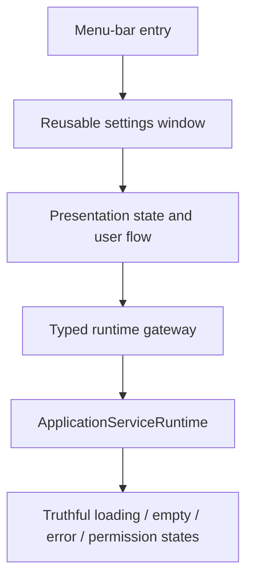

# OpenJoystickDriver Apple UI seams

Use with `$apple-design-hig` for platform guidance and
`$skizzles:design-proof-gate` for screenshot/accessibility evidence.

## Presentation ownership

Presentation source lives under `Sources/OpenJoystickDriver/App/Presentation/`.
The source owners are `Controllers`, `InputCapture`, `Profiles`, `Runtime`,
`Settings`, and `MenuBar`. The documented test owners mirror the four user-flow
surfaces `InputCapture`, `Profiles`, `Runtime`, and `Settings`; Controllers,
MenuBar, and app Diagnostics use their nearest presentation/runtime owner.

Keep shared controller/protocol behavior in
`Sources/OpenJoystickDriverKit/`; the app composes it and owns the single
`ApplicationServiceRuntime` gateway.

## Required states

Every changed user flow should identify the visual and interaction behavior for:

- loading and cancellation;
- empty and unavailable data;
- permission denied or system-extension not ready;
- runtime/network/IPC failure and recovery;
- stale responses after a view disappears or a profile changes;
- success confirmation without relying on animation or prose-only hints.

## Apple proof points

- One reusable settings window; no duplicate lifecycle or runtime instance.
- Semantic native controls with labels, focus order, keyboard behavior, and
  VoiceOver announcements.
- Full Keyboard Access, Dynamic Type/system text sizing, contrast, light/dark
  appearance, and reduced-motion behavior.
- Truthful permission affordances: guide users to a system setting without
  claiming access the runtime has not observed.
- Screenshot-backed proof for layout and state changes; product behavior tests
  for gateways and state, never source or view-prose assertions.
