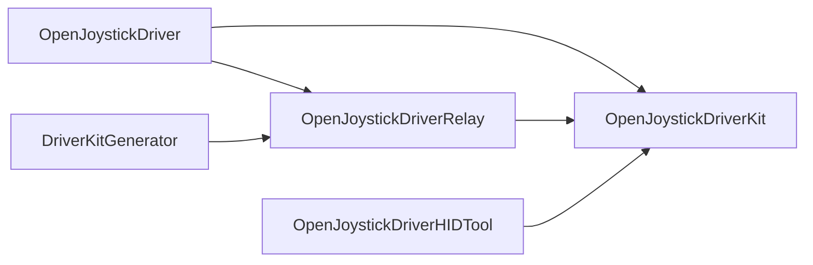

# Product boundaries

Use this reference for behavior changes that stay inside an existing owner. The
canonical topology decision remains `docs/development/source-topology.md`;
source/test moves belong to `$organize-openjoystickdriver`.

## Package dependencies

The arrows below mean “depends on”; they point from dependent to dependency.

`OpenJoystickDriverKit` is reusable controller/domain code and never imports
`SwifterKit`. Only `OpenJoystickDriverRelay` and `DriverKitGenerator` import it.
The app is the composition root and owns one `ApplicationServiceRuntime`, one
authenticated RPC socket, and the app lifecycle.

## Generated and canonical inputs

- `DriverKitGenerator` and `OpenJoystickDriverRelay` author the generated native
  project; `.build/driverkit/generated/` is ephemeral and never hand-edited.
- Controller runtime records under
  `Sources/OpenJoystickDriverKit/Resources/Controllers/` are generated catalog
  data. Change locked sources or `Resources/ControllerOverrides/`, then use the
  catalog generator.
- Package resources, entitlements, RPC payloads, and the exact DriverKit
  user-client allowlist are contracts, not incidental file layout.
- A behavior change keeps shared protocol logic in Kit, composition and platform
  adapters in the app, and SwifterKit-specific behavior in Relay/Generator.

## Boundary checklist

Before editing, identify the existing target, public/internal seam, lifecycle,
failure owner, canonical input, and generated output. If the change needs a new
owner, source/test move, UI flow, or evidence plan, route it to the specialized
skill instead of broadening this one.
