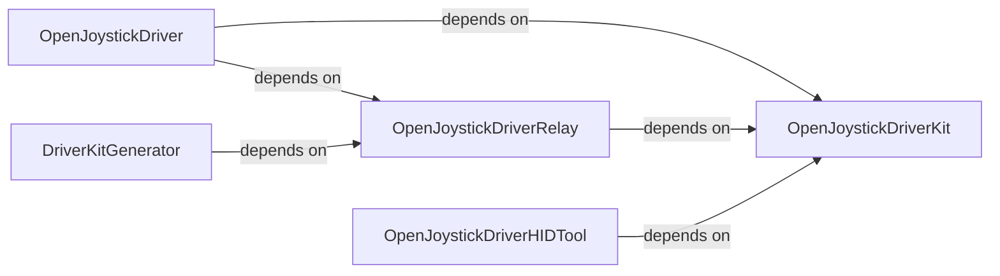
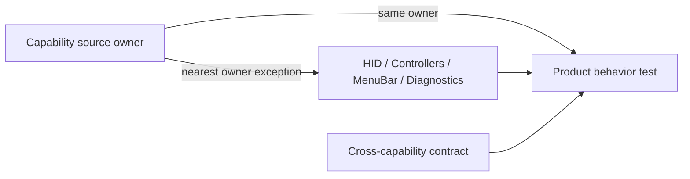

# Source and test ownership map

The canonical architecture decision is `docs/development/source-topology.md`.
Use this reference as a routing index, then verify exact paths in the working
tree before editing.

## Existing targets

```text
OpenJoystickDriverKit       reusable controller/domain and service contracts
OpenJoystickDriverRelay     SwifterKit DriverKit adapter
DriverKitGenerator          generated native-project input/generator
OpenJoystickDriver          app composition root, UI, CLI, runtime adapters
OpenJoystickDriverHIDTool   focused hardware investigation executable
OpenJoystickDriverGameControllerProbe  isolated visibility probe
```

The dependency direction remains inward. Arrows mean “depends on” and point
from dependent to dependency:

```text
App -> Kit
App -> Relay -> Kit
Generator -> Relay
HIDTool -> Kit
```

`OpenJoystickDriverKit` never imports `SwifterKit`; only Relay and Generator do.
The app owns the single runtime and authenticated RPC server.



## Kit owners and tests

```text
Sources/OpenJoystickDriverKit/       Tests/OpenJoystickDriverKitTests/
  ApplicationService/                  ApplicationService/
  Device/                              Device/
  HID/                                 nearest HID, Device, or Integration test
  Diagnostics/                         Diagnostics/
  Output/                              Output/
  Permissions/                         Permissions/
  Process/                             Process/
  Protocol/                            Protocol/
  Remapping/                           Remapping/
  Update/                              Update/
```

Nested directories deepen a behavior owner (`Device/Discovery`,
`Protocol/Parsers`, `Output/Foreground`, `Remapping/Engine`). `Integration/` is
test-only for cross-capability packaging/runtime checks.

## App owners and tests

```text
Sources/OpenJoystickDriver/           Tests/OpenJoystickDriverTests/
  App/Presentation/                    App/Presentation/
  CLI/                                 CLI/
  Diagnostics/                         nearest App/Presentation or Runtime test
  Remapping/                            Remapping/
  Runtime/                              Runtime/
  Status/                               Status/
```

The source presentation owners include `Controllers`, `InputCapture`,
`Profiles`, `Runtime`, `Settings`, and `MenuBar`. The documented test owners
are `InputCapture`, `Profiles`, `Runtime`, and `Settings`; Controllers, MenuBar,
and app Diagnostics use their nearest user-flow/runtime test owner. CLI mirrors
Catalog and Commands; Remapping mirrors Profiles, Routing, and SystemEvents;
Runtime mirrors RPC; Status mirrors RuntimeSnapshot and SystemExtension.



## Mapping rule

For every moved or new declaration, write down: behavior owner, target, public
boundary, lifecycle, dependencies, matching behavior-test path, generated-input
owner, and rollback path. If the answers disagree, stop and record an
architecture decision instead of adding an alias or generic bucket.
