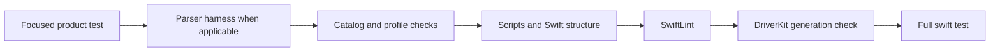

# Product-only validation

This skill validates the Swift product, not the implementation of repository
scripts. `Tests/` must call `Sources/` APIs (or a supported relay/generator
product API) and observe behavior. Never create `Tests/Scripts`, read a script,
Swift source, or documentation file as a fixture, or assert source/prose
substrings. Machine-readable product identifiers or protocol/persistence fields
may be asserted when they are observable, documented contracts; never assert
human-readable message/help text. Prefer typed state, return codes, routes,
identifiers, events, and payload structure.

## Focused proof

Choose the smallest owning target and test first:

| Change | First proof |
| --- | --- |
| Parser/protocol/HID | The affected `OpenJoystickDriverKitTests` filter, then `./scripts/ojd test parsers-macos14`. |
| Controller record/catalog | The relevant Kit test filter, then `./scripts/ojd catalog regenerate --check` and `./scripts/ojd check profiles`. |
| App CLI/remapping/runtime/status | The affected `OpenJoystickDriverTests` filter; exercise the public or `@testable` product seam. |
| Relay/generator | The affected relay/generator test target, then `./scripts/ojd check driverkit`; never edit generated output. |
| Hardware/permissions/installation | Run the documented diagnostic or manual proof; state when local hardware, signing, or macOS access is unavailable. |

Use SwiftPM filters against product targets, for example:

```sh
swift test --filter OpenJoystickDriverKitTests.Protocol.Parsers
swift test --filter OpenJoystickDriverTests.CLI
```

Adjust filters to the actual test names. Do not replace a missing hardware test
  with a source-text fixture or a human-readable message assertion.

## Required gate order

From the repository root, after focused proof, run the applicable gates in this
order:

```sh
./scripts/ojd catalog regenerate --check
./scripts/ojd check profiles
./scripts/ojd check scripts
./scripts/ojd check swift-structure
./scripts/ojd lint
./scripts/ojd check driverkit
swift test
```

Not every change needs every gate, but explain omissions. `check scripts`
validates script ownership, paths, modes, and shell syntax; it is the script test
route, not a Swift test fixture. The parser harness is likewise a supported
`ojd` route and must remain outside `Tests/`.

If `swift test` reports the documented SwiftPM module-cache mismatch, run:

```sh
./scripts/ojd repair swiftpm-module-cache
swift test
```

Do not weaken the test command or silently ignore a failed gate.



## Structural and architecture review

Before handoff:

1. Run `python3 "$HOME/.agents/scripts/validate_skill.py"` for a skill change,
   using the owned skill directory.
2. Run `git diff --check` and inspect the diff and target membership.
3. Confirm tests map to one canonical source owner and no stale duplicate path,
   generated DriverKit output, or test-only script bucket was introduced.
4. If source/test topology changed, run the full `$architecture-enforce` audit
   with no suppressions or baseline edits; resolve or report every warning/error.
5. Keep parser and hardware evidence separate: a passing parser harness proves
   parser behavior, not physical controller support, signing, or permissions.

## Reporting blockers

Report an exact blocker instead of claiming completion. Include:

- command and working directory;
- exit status and the relevant non-secret output;
- whether the failure is attributable to the change or pre-existing/toolchain,
  hardware, signing, permission, or environment state;
- attempted recovery (including module-cache repair when applicable);
- focused evidence that did pass and the remaining risk.

Do not publish secrets, raw serial values, or unredacted packet captures. A
hardware diagnostic may be valid evidence while still being unavailable locally;
record that limitation and route the next proof to the documented procedure.
