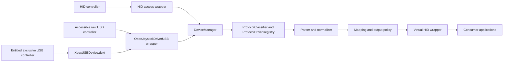
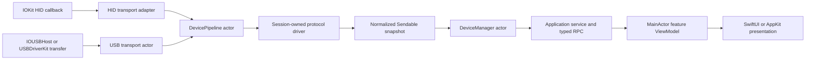
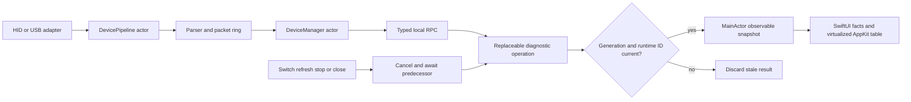
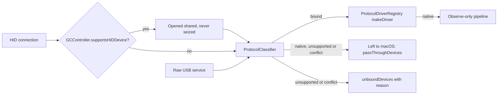
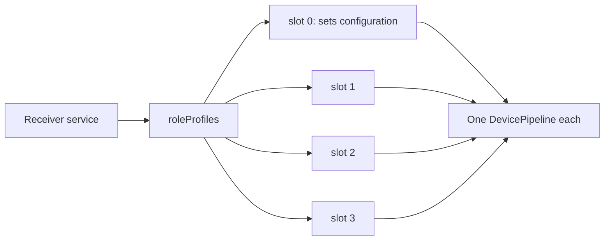

# Architecture

OpenJoystickDriver ships one application bundle, one persistent host process, and one generated USBDriverKit system extension. The app owns controller semantics, virtual output, authenticated local commands, and the AppKit menu/settings UI. Most accessible raw USB interfaces are opened directly by the app. The DEXT is a restricted owner for devices covered by OJD's Apple-issued USB transport entitlement.

## Controller Ownership And Concurrency

`DeviceManager` is the inventory actor and the only owner of physical discovery and exact-device selection. Each protocol role of a connected device has one `DevicePipeline` actor, created, replaced, and stopped by the manager; see [Composite devices and roles](#composite-devices-and-roles). The pipeline exclusively owns its mutable protocol driver, normalized input/output state, transport coordination, and retained run and idle tasks.

- HID and USB adapters own platform handles and translate callbacks or transfers into copied data.
- Decoding and controller state mutation execute only on the pipeline actor, never on `@MainActor`.
- `PhysicalProtocolDriver` is not `Sendable`; a driver is transferred once into its session.
- USB startup, keep-alive, and physical output are parser-produced value plans executed by the pipeline's transport session, keeping device I/O out of decoding objects.
- Replacement and shutdown cancel and await established session tasks before the old pipeline is discarded. A non-cooperative platform open that has not produced a session cannot block shutdown; its late result observes the inactive generation and is closed without publishing state.
- `@MainActor` owns application, window, menu, panel, and observable presentation state only.

### Developer Diagnostics Lifetime

Developer diagnostics observe the existing service-owned sessions; they never open a second HID or USB reader. One replaceable operation owns the selected controller snapshot and packet-capture request. Replacing, refreshing, stopping, or closing first cancels and awaits that operation, then starts or publishes only for the current generation and exact runtime identifier.

Packet differencing, classification, and bulk formatting stay outside `@MainActor`. The main actor owns only AppKit/SwiftUI lifecycle and publication of bounded, already-derived presentation snapshots. The complete raw capture remains authoritative for copy and export; table virtualization changes rendering cost, not capture contents or device cadence.

## Classification And Binding

`ProtocolClassifier` (`OpenJoystickDriverKit/Protocol/Classification/`) selects one protocol from observed `PhysicalDevice` facts. It performs no I/O and no classification write. Precedence:

1. the exact catalog row for the VID/PID; its family must match the observed access path (raw USB or HID);
1. an interface class/subclass/protocol signature pinned to Linux `xpad.c` (XID `58/42/00`, XUSB wired and receiver, GIP on interface 0);
1. the device-descriptor GIP triple `FF/47/D0`, only on an unconfigured device that exposes no interface facts;
1. `hid.descriptor`, only on IOHID and only after `HIDDescriptorContract` accepts the report descriptor. A catalog row naming `hid.descriptor` must pass the same contract.

A validation failure never falls through to a lower level, and no device falls back to a generic HID parser. The result is `.bound(ProtocolBinding)`, `.unsupported(reason)` or `.conflict(reason, candidates:)`. `ProtocolBindingReason` has exactly ten IDs: `no-protocol-match`, `ambiguous-protocol-match`, `interface-contract-mismatch`, `descriptor-contract-mismatch`, `packet-contract-mismatch`, `unsupported-protocol-variant`, `unsupported-transport-variant`, `required-initialization-failed`, `catalog-conflict` and `virtual-profile-unavailable`. A binding's `ProtocolBindingID` has the form `family[:variant]`, for example `xbox.xusb:receiver` or `hid.descriptor`; the variant is required exactly when the family declares variants. Records store a variant only when the transport cannot decide it; they carry no transport field, since the family and variant determine the access path.

`ProtocolDriverRegistry` replaces the former `ParserRegistry`. It builds `PhysicalProtocolDriver` values from one exhaustive switch over `PhysicalProtocolID`, and `runtimeProfile(for:)` returns the binding's catalog record or, for a signature binding, the family defaults (GIP sets configuration 1 before the claim). `makeDriver(for:identifier:claimed:)` is the only runtime factory: a raw-USB binding passes its claimed facts (the resolved profile and the observed device), and the claimed interface contract must hold before a driver exists. HID bindings pass no claimed facts; classification already checked their descriptor contract. `makeUnobservedDriver` serves only profile capabilities and record rendering, which have no device. A device that does not bind gets no driver. A driver's `DriverSessionPlan` fixes its report liveness timeout and whether output waits for a receiver presence connect.

Native gamepads are observed and remapped. A device for which `GCController.supportsHIDDevice` is true, and whose record does not set `ownership: ojd`, is opened shared with input callbacks and never seized. It stays out of its location's ownership and disconnect coalescing, and it is classified and bound like any HID device. Its `DevicePipeline` carries a `MacOSOwnedOutput` allowance, the protocol family's default plus the report of the record's `output.rumble` template: OJD sends it no startup, feature, status, periodic, shutdown or recovery report, reads no feature report unless the allowance says so (motion keeps nominal calibration), and the HID write executors refuse every report whose kind, report ID and length the allowance does not name. The only family default is the DualShock 3 / Sixaxis. macOS never sets its player LED: output report 0x01, sent with player 1 after the first input report and on player-indicator requests. On USB it sends no input and ignores that report until the host reads feature 0xF2, which macOS does not do, so OJD makes the driver's F2 and F5 reads at bind. The Ant Esports GP100's record adds its vendor rumble report 0x02, which macOS has no driver for; no other record names a template. Its `physicalOwnership` is `nativeGamepad`, which `ControllerExposureDecision` suppresses for every intent, so OJD never publishes a virtual gamepad for it. Remapping profiles still run on its input; a profile that needs exclusive input or a virtual gamepad is ineligible. While no remapping route selects the controller, its pipeline parses reports but dispatches nothing (`ObservedInputDemand`); a profile selected later takes effect without reconnecting. Element values are delivered only to a driver whose `DriverSessionPlan.parsesHIDElementValues` is set. A user-requested wireless disconnect still applies to a native controller. Every other HID interface at a native controller's location is left to macOS: it is never seized, OJD tears down any pipeline bound there, releases its claim and routes none of its input. An interface that connects after the native one is reported under `passThroughDevices`, as is a native device no driver binds; one rejected earlier stays under `unboundDevices`. Location 0 identifies no controller and is never shared.

Devices that do not bind are recorded in the application-service payload's `unboundDevices` with their backend, reason, interface summaries, and rejected candidates. Each bound controller carries the matching binding result: its rule, matched predicates, and catalog record ID. Support reports include both. `status` prints them under `Unbound devices` and pass-through devices under `Left to macOS`; `status --json` carries both arrays. OJD holds its input claim on a rejected HID connection only while a bound pipeline shares the same physical controller or routing location, which prevents duplicate input, and otherwise releases it so the device stays with macOS.

Under the Automatic intent, `AutomaticUserSpaceOutputDispatcher` publishes one virtual profile per eligible controller. `VirtualHIDProfileSelector` chooses it from the controller's declared controls alone: `hid-xbox-one-s-bt` (`045E:02FD`) when it can carry every primary control, otherwise `hid-generic`. Protocol binding, foreground app and browser engine play no part. Both profiles carry every primary control today, so Automatic always selects `hid-xbox-one-s-bt`.

The catalog is generated from Linux `xpad.c` and SDL `controller_list.h`, pinned in `ControllerSources.lock.json`, plus authored overrides; see [xpad import](xpad-import.md).

## Composite Devices And Roles

One physical device can expose several protocol roles, each its own pipeline and logical controller. Today only the Xbox 360 wireless receiver (raw USB) and the Steam Controller (HID) declare more than one role; every other family runs one role per device.

### Identity

`ControllerIdentity` (`Device/Identity.swift`) is the product and physical identity: VID, PID and serial number, with an empty serial stored as nil. `DeviceIdentifier` is the logical-controller key: a `ControllerIdentity` plus `locationID` and `interfaceNumber`. The interface number is part of equality, the runtime token and `description` (`if=N`). Raw USB keys carry the claimed interface; HID keys carry one only for a HID role; Bluetooth keys carry none.

`UserSpaceVirtualDeviceConstants.stableKey` (`HID/PhysicalHIDTrackingStateMachine.swift`) hashes `VID:PID:serial:location:interface` with FNV-1a to derive the virtual serial and OJD-namespace LocationID, so each role gets its own virtual identity without exposing the hardware serial.

`DeviceManager.isSamePhysicalController` decides whether two keys reached through different services are one controller: the same `ControllerIdentity`, and either a serial number or the same location. A raw-USB admission conflicts when its exact key already runs, or when the same physical controller runs through another service (another route, location, or HID). Roles of one service never conflict with each other.

### Raw-USB Roles

`ProtocolDriverRegistry.roleProfiles(for:resolution:)` returns the roles of one claim. An `xbox.xusb:receiver` binding whose row pins no interface or endpoint gets one role per observed alternate-setting-0 interface with triple FF/5D/81 and one interrupt IN and one interrupt OUT endpoint, as `xpad_probe` checks. Roles are sorted by interface number, capped at four, and a role's index is its slot ordinal. Every other family, a pinned receiver row, and a receiver with no qualifying interface run the claim as their single role.

- Admission is atomic per service. `startUSBRoles` starts roles in order; a conflict, driver failure or lost generation stops every started role and returns `.retry`, so the next poll admits the service whole.
- Detach removes every role mapped to the service in one pass, through the same `removeUSBRole` that rollback uses.
- Only slot 0 keeps `needsSetConfiguration`. `IOUSBHostTransportProvider` also skips SET_CONFIGURATION when the device's current configuration already equals the requested one (`USBTransportOpenOptions.setsConfiguration(current:)`), because SET_CONFIGURATION terminates every open interface. A slot 0 reopen therefore does not end slots 1–3. This also applies to GIP rows that set configuration 1 before the claim.

### HID Roles

`ProtocolDriverRegistry.hidConnectionRole(of:)` returns `.location`, `.interface(n)` or `.notARole`. Only `valve.steam-controller` declares roles: a connection is a role when its report descriptor has a Feature item (`steam_is_valve_interface` in `hid-steam.c`) and its parent USB `bInterfaceNumber` was observed; otherwise it fails closed as `.notARole`. Every other family is `.location`: one controller per routing location, keyed without an interface.

Input from a role connection routes to that connection's key only (`hidPipelineKey`); other connections route by location to keys without an interface. Role writes and startup feature reads target the exact connection, and role-family connections disconnect one at a time. Ownership is still per location: seizing, releasing or reacquiring one role's interface acts on every interface at that location, including sibling roles. Claim release on rejected connections is per location too.

### Assembly Hook

A catalog row may name a driver-owned `ControllerAssemblyPolicy` in `protocol.assembly` to combine several roles into one logical controller. The vocabulary is empty: the schema enum is `[]` and the decoder rejects every name, because no row has multi-interface evidence yet. `handleHIDDeviceConnected` consumes `ProtocolDriverRegistry.assemblyPolicy(for:)` through an exhaustive switch, so the first policy case must add its assembly branch there. Until then one role is one logical controller.

### Receiver Presence

`XUSBDriver(slotOrdinal:)` builds one receiver slot (0–3; other values fail). Its startup write is the presence inquiry `08 00 0F C0 00…` (12 bytes, from `xpad.c`), which tolerates rejection. Pad data is dropped until a presence report connects the slot. Pad data on a disconnected slot re-sends the inquiry on the first such report and every 16th after it, at most 8 times. On connect the slot lights ring LED player n+1 (steady, by slot order). A new transport session resets presence, so the next presence reply reconnects the slot.

## Platform Split

The package deployment floor remains macOS 10.15. HID uses IOKit on every supported macOS, so no HID path selects an implementation by OS version. macOS 10.15 and 11 have no Swift Concurrency runtime, so the app bundle carries the toolchain's back-deployment `libswift_Concurrency.dylib` in `Contents/Frameworks`.

| Capability | macOS 10.15+ |
| --- | --- |
| Physical HID discovery and reports | `IOHIDManager` / `IOHIDDevice` |
| Consumer virtual HID | `IOHIDUserDevice` |
| Raw/custom USB | app-side IOUSBHost or restricted USBDriverKit DEXT |
| HID DEXT implementation | HIDDriverKit when needed |

The SDK marks `IOHIDUserDeviceCreateWithProperties` available from macOS 10.15 with no deprecation, so `IOHIDUserDevice` is the only virtual HID publisher. The package does not link CoreHID. Publishing a logical controller is one `IOHIDUserDeviceCreateWithProperties` call with the profile's complete identity properties; there is no fallback property set or retry with a reduced property set. On macOS 27 the published device reports `Transport` as `Virtual` whatever the profile requests, so consumers do not see the profile's transport value.

## Switch 2 Bluetooth LE

Switch 2 controllers over Bluetooth speak GATT only, so IOHID never sees them. `Switch2BluetoothLECentral` in `OpenJoystickDriverService` owns CoreBluetooth on one serial queue. It connects to controllers whose advertisement names a Switch 2 product and gives each ready link to `Switch2BluetoothLEHub` in `OpenJoystickDriverKit`. The kit never imports CoreBluetooth. The hub reaches the link only through the `Switch2BluetoothLEWriter` protocol.

The hub gives each link a synthetic routing location from `0xB1E0_0000` upward. `DeviceManager` takes an optional hub. With one, `BluetoothLECompositeHIDBackend` merges the hub's connections into the IOHID event stream and routes output by location. `BluetoothLECompositeUSBTransportProvider` opens a hub location as a `Switch2BluetoothLECommandSession`, whose bulk OUT writes go to the command characteristic and whose bulk IN reads return reply notifications. So `Switch2Driver` runs unchanged over both links, apart from its transport byte. The merged HID stream ends with the IOHID stream, so an IOHID access failure also stops the Bluetooth LE pipelines until detection restarts. The synthetic location range is assumed to be free of IOHID locations. This is not verified.

## USB Transport Boundary

`OpenJoystickDriverKit` owns the asynchronous `USBTransportProvider` and `USBTransportSession` ports plus all parsing and controller policy. It never imports SwifterKit. `OpenJoystickDriverUSB` is the app-side platform facade. Its direct backend opens accessible vendor-specific interfaces with IOUSBHost. Its USBDriverKit backend talks to OJD's restricted DEXT. The facade owns discovery, session lifetimes, transfers, configuration/alternate-setting requests, and platform error translation. Parsers and application callers receive one route-tagged API and never handle IOUSBHost, DriverKit, or SwifterKit types.

Selection follows ownership evidence, not controller brand. A service exposed by the DEXT stays on that route. Models covered by the production USB transport entitlement never silently fall back to direct app-side access. Other raw USB controllers use IOUSBHost when macOS permits the app to own their interface. Failure to open one route is reported instead of retried through another route.

USB descriptor observation is represented by `PhysicalDevice`, per-alternate-setting `PhysicalInterfaceSignature`, and optional `PhysicalEndpointSignature` values in `OpenJoystickDriverKit/Device/PhysicalInterfaceSignature.swift`. The passive registry probe preserves absent descriptor fields as `nil` and keeps alternate settings distinct; the classifier, descriptor transport resolver, and USB diagnostic scanner consume these signatures. A missing configuration descriptor stays `interfaces == nil`, distinct from a parsed configuration with no interfaces. The passive path records host-facing USB but does not infer the controller-side link from a product/receiver name. It preserves the concrete `USBTransportRoute` separately: direct IOUSBHost currently has no `DeviceAccessBackend` value, while an observed DEXT route maps to `usb-driverkit`.

`IOUSBHostPassiveUSBRegistrySource` reads the SDK-defined `bcdDevice` registry property when the matched device node exposes it as an unsigned 16-bit value. The SDK header defines `kUSBHostMatchingPropertyDeviceReleaseNumber` as `bcdDevice`; Apple documents [`IOUSBHostMatchingPropertyKeyDeviceReleaseNumber`][1] as the device-release matching property. `PassiveUSBRegistryFactParser` carries that raw value as `PassiveUSBObservedUSBFacts.deviceRelease`, and passive observation forwards it to `PhysicalDevice.deviceRelease`; a missing or out-of-range value remains nil. This code-level path does not establish property availability on any physical device.

Raw-USB enumeration admits catalog rows that declare raw USB access. `TransportFacade` also admits an uncatalogued IOUSBHost device when its passive facts carry a known Xbox interface or device signature (`ProtocolDriverRegistry.carriesProtocolSignature`), so classification can bind or report it. After admission, `USBTransportProvider.resolveTransport` returns the catalog-derived endpoint profile together with an optional `PhysicalDevice`. The IOUSBHost facade uses the same single best-effort passive observation to derive the profile and facts; an absent or failed observation preserves the configured profile and returns no snapshot. USBDriverKit retains that same configured profile and can additionally provide a limited snapshot from its cached `DriverService`: exact `service.id`, VID/PID, available product/serial properties, and the physical location property only when present. `USBTransportDevice.locationID` remains a routing value and may fall back to low service-ID bits; the separate observed physical location remains nil in that case. The snapshot marks host transport `.usb`, access backend `.usbDriverKit`, and route `.usbDriverKit`; device release/class, configuration, interface numbers, endpoints, and other unobserved facts remain nil. The facade correlates the snapshot by exact service identity and matching observed device properties, returns it for DEXT diagnostics/resolution, and does not call the direct IOUSBHost passive probe for that route. Providers using the default implementation still retain the configured profile without synthesizing facts. `USBDiscovery` accepts a snapshot only when its `serviceIdentity` exactly matches the enumerated route/service, then revalidates that identity and the enumerated device facts after the await before it stores the snapshot in `DeviceInfo`. `DeviceInfo` retains the exact `USBTransportDevice` enumeration snapshot separately from the optional descriptor-derived `PhysicalDevice`; service identity is route ownership, not fabricated descriptor evidence. The post-start claim is acknowledged only while the current record still belongs to that exact raw USB snapshot. Detach consumes its old service mapping but removes a pipeline/info only if the current record still has that same raw USB snapshot, so a same-identifier HID takeover survives the old USB detach. `USBResolutionRuntimeTests.oldUSBDetachDoesNotRemoveHIDThatTookOverTheSameIdentifier` exercises USB admission, real HID takeover, and later provider detach with a fake provider. This is software behavior evidence only. Unsupported catalog identities never invoke per-service resolution, and the existing endpoint profile is still used for parser construction and session open. Acknowledged services are not resolved again on every enumeration poll; a service whose handling returns `.retry` is resolved again on its next attempt. The passive registry source now carries each node's `IORegistryEntryGetRegistryEntryID`; runtime observation requires a unique root with the exact enumerated service ID and matching VID/PID/location, with no location-only fallback. Missing or mismatched IDs produce no physical snapshot, while tuple-only contributor diagnostics keep their existing matching and ambiguity behavior. Software tests cover same-tuple/location duplicate roots, missing/mismatched IDs, profile delivery, snapshot retention, and clearing on detach; they do not validate live registry correspondence on hardware. At the poll-to-manager boundary, `USBEnumerationTracker` emits typed attach, detach, and access-failure deltas over exact service snapshots. A provider failure preserves acknowledged services without synthesizing detach; a later successful poll reconciles state. Changed facts under the same service identity produce old detach before replacement attach, while `.retry` remains eligible on the existing 500 ms cadence. `USBDetectionAdmissionTests` exercise failure, recovery and event order with a fake provider; `USBResolutionRuntimeTests` verify retained manager state through enumeration failure and re-resolution after changed facts. These are software checks only. USB admission captures the manager lifecycle generation and checks it with cancellation before event processing and after awaited poll, resolution, revalidation, and pipeline startup work. `stop()` does not await a noncooperative USB provider; a stale admitted candidate returns without inserting state. `USBResolutionRuntimeTests.stopInvalidatesUSBAdmissionHeldInNoncooperativeResolution` verifies stop completion while resolution is gated, then releases the provider and asserts no info, pipeline, or open occurs. Removal clears state synchronously before awaiting the captured old pipeline stop and does no later state deletion; both the exact raw-service snapshot and HID source gate prevent an old USB detach from removing a replacement route. Per-interface access-failure recovery, suspend/resume and hardware validation remain open.

The IORegistry publishes interface class triples but no endpoint descriptors, and an unconfigured device publishes no interfaces. When the passive facts of an IOUSBHost device, pinned or not, cannot resolve an interface with endpoints, `USBTransportProvider.resolveUSBConfiguration` reads the descriptor of configuration 1 through `IOUSBHostTransportProvider.cachedConfigurationDescriptor` without SET_CONFIGURATION or an interface claim. `ProtocolDriverRegistry.makeDriver` then checks the claimed interface number, alternate setting, class triple and interrupt endpoint pair before it builds the driver and before the pipeline opens, so before SET_CONFIGURATION and any protocol write. A failure is reported as unbound with `interface-contract-mismatch`. Catalog endpoint pins stay authoritative, but a pinned device's descriptor is read too, so the check confirms its class triple, alternate setting, and that the pinned endpoints are interrupt IN/OUT endpoints of the claimed interface; an unreadable descriptor is retried. The DriverKit route reports no interface facts, so a catalog row claimed there is not checked and runs on its record alone; a signature binding fails closed on it. The HIDTool record probe resolves and validates the same way before it opens the device, and refuses a device that fails. A signature binding fails closed when the interface was not observed; an unreadable descriptor is retried on a later poll rather than run on family-default endpoints.

The GIP parser resends its startup sequence when the controller announces before its first input: on the first announce and every fourth after it, at most eight times.

The DEXT snapshot is derived from synthetic and cached `DriverService` properties; no live extension service, device, or hardware observation was verified. Its property set does not prove that a particular device exposes a physical location or any omitted descriptor fact. The active direct IOUSBHost route remains outside the target `DeviceAccessBackend` vocabulary, and the currently restricted DEXT match/entitlement does not provide broad coverage for the other catalog raw-USB identities. The access-route and entitlement decision remains unresolved; no target or entitlement scope has been widened.

The USB diagnostic scanner retains a route-only DEXT snapshot but leaves protocol classification of a catalogued model unavailable until the observed facts needed by the predicates are complete: interface number, alternate setting, class/subclass/protocol, and endpoints whose address, direction, and transfer type are all known; HID interfaces also need nonnil collection and element availability facts in the HID layout. A partial snapshot does not become a negative `unsupported` result. An empty interface list is distinct: the passive probe represents a successfully parsed configuration with no interfaces as `[]`, while unavailable configuration facts remain nil, so this specific empty list is complete negative evidence. An uncatalogued model is classified from the passive facts that admitted it, as runtime binding does. The IOUSBHost device-service adapter also carries its actual `locationID` into `observedPhysicalLocationIdentifier`; its existing routing location and other direct observation behavior are unchanged.

HID `.connected` events also carry immutable `PhysicalDevice` facts from IOHID, with the backend's runtime routing location kept separate from the optional physical location. IOHID records descriptor bytes/hash, usage pairs, report IDs and the framework's per-kind maximum report sizes when exposed. The collector preserves the reported `kIOHIDManufacturerKey` string, leaves it nil when unavailable, and never infers it from VID. It leaves USB interface number/class/configuration and unavailable identity fields nil. Only explicit USB and Bluetooth Low Energy values map to typed host transport; generic Bluetooth remains a property value and is not split into classic/BLE. `physicalTransport` is not inferred. `DeviceInfo` retains the snapshot through HID ownership reacquisition, and each HID disconnect event now carries the same immutable `PhysicalDevice` and per-connection token as its connect event. IOHID retains that connection until removal; `DeviceManager` clears state only when the detach token and snapshot match the current connection. Full manager stop clears retained snapshots. It cancels and awaits the permission watcher and HID detector before it waits for pending HID initialization, so those tasks cannot restart discovery during shutdown. HID startup feature/output/status operations, recovery sends and periodic-output scheduling also revalidate the active pipeline, connection token and immutable snapshot after awaited work. Resume reuses the exact token in the current `DeviceInfo`. Serialized physical HID writes recheck pipeline identity after the awaited output-rate limiter. A gated software test verifies that stale startup cannot cancel a replacement GameSir heartbeat; this does not verify a physical HID send. `DeviceAccessBackend` keeps the exact target values `iohid` and `usb-driverkit`; IOHID connections set `accessBackend = .ioHID`. The active direct IOUSBHost route remains outside the target backend enum. `HIDDeviceEvent.accessFailure` distinguishes failed access from physical detach. IOHID reports a non-success `IOHIDManagerOpen` result as its `IOReturn` before cleanup. Cancellation is not an access failure. `DeviceManager` clears HID pipelines/snapshots and awaits pending initialization on this event. It snapshots the exact HID connection token, physical facts, and pipeline before that await, then removes only matching state; a delayed access-failure or denied-state cleanup cannot remove a newer granted-session connection. Detection completion clears only its matching session task, allowing the existing one-second permission watcher to retry later; there is no immediate restart loop. Scripted `StartupLifetimeTests` cover stale-state teardown, retry cadence, stale completion ownership, and gated access-failure/denied teardown interleavings. A gated same-route replacement regression also verifies that an aborted replacement cannot leave the old snapshot behind; teardown and canceled-init completion remove only matching orphan state when no newer route is active. These are software tests only. System sleep tears every controller down through the same path as `DeviceManager.stop()`: physical outputs and HID shutdown reports are sent while the HID session is still open, then pipelines, detection, and timers stop and the inventory clears. Wake calls the ordinary `start()`, so controllers return through normal hot-plug. Once teardown starts, output guards accept only writes made inside the `ControllerTeardownOutput` task-local scope, so a request already in flight cannot re-enable an output. Manual suspension is user intent kept by `DeviceManager` for the exact controller identity until `controller resume`, a physical disconnect, or `stop()`; a pipeline for a suspended identity starts suspended, so the choice survives sleep. `SystemPowerNotificationObserver` delivers the macOS sleep and wake notifications in order, and a revoked `DeviceManagerSystemPowerEventSession` keeps a late event from a stopped runtime out of a restarted manager. Lifecycle remains incomplete: repeated retries while permission remains granted have no cap/backoff (policy remains open). USB access-failure/recovery, both route mappings, and hardware qualification remain open. No hardware observation is implied.

`DriverKitGenerator` consumes the sole `USBDriverKitExtensionConfiguration`. Development and production generation both match only Apple's approved Microsoft pairs: `045E:02D1`, `045E:02DD`, `045E:02E3`, `045E:02EA`, `045E:0B00`, `045E:0B0A`, and `045E:0B12`. The configuration uses bundle identifier `com.openjoystickdriver.XboxUSBDevice`, provider `IOUSBHostInterface`, configuration 1, interface 0, class `0xFF`, subclass `0x47`, and protocol `0xD0`. Accessible third-party GIP controllers such as `3537:1010` stay on the direct IOUSBHost route; their catalog profile may request configuration 1 before the facade resolves an interface.

The DEXT does not parse controller protocols and does not create virtual HID devices. Its entitlements contain only the DriverKit base entitlement and the appropriate USB transport value. `com.apple.developer.hid.virtual.device` belongs only to the app. The app's DriverKit user-client allowlist contains exactly `com.openjoystickdriver.XboxUSBDevice`; allow-any access is forbidden. The external XboxUSBDevice identity remains unchanged because it is the identity Apple approved; the internal transport abstractions are controller-neutral.

See [Apple controller ownership evidence](apple-controller-ownership.md) for the installed-system observations, entitlement scope, and why an Apple personality list is not OJD's support catalog.

Every DriverKit build generates a fresh native project under `.build/driverkit/generated/` and builds under `.build/driverkit/derived-data/`. Generated output is ephemeral; never edit or commit it. `./Scripts/ojd check driverkit` checks the entitlement, personality, determinism, dependency direction, and an unsigned universal build.

[1]: https://developer.apple.com/documentation/iousbhost/iousbhostmatchingpropertykey/devicereleasenumber

## Process And Command Lifecycle

Launching the signed app starts the runtime, one status item, and one reusable settings window. Closing settings does not stop controller processing. `SIGTERM` and `SIGINT` stop the runtime cleanly. Headless commands invoke the same executable and reach live state through the private Unix-domain socket at `/tmp/com.openjoystickdriver.<uid>.rpc`. The socket is mode `0600`; the server requires the same user, signing identifier, and team identifier. Frames and deadlines are bounded. Repository-built CLI commands use the installed signed executable when available. This keeps `swift run` and direct `.build` commands within the same RPC authentication boundary without trusting unsigned development clients. Forwarding stops when the installed executable is older than the repository sources, so validation cannot silently run stale CLI code.

## Permissions

- The app carries `com.apple.developer.hid.virtual.device` for `IOHIDUserDevice` virtual devices.
- Virtual HID creation retains its evidenced Input Monitoring and Accessibility checks on every supported macOS.
- CoreGraphics post-event access independently authorizes remapped keyboard, pointer, and scroll events.
- The USB DEXT uses DriverKit/USB provisioning and has no virtual-HID entitlement.

Hardware access, signing, activation, and permission behavior still require focused signed-device validation; an unsigned build cannot prove those boundaries.
