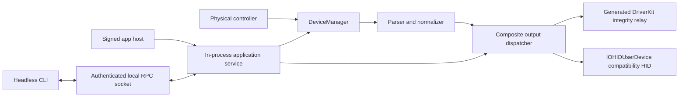

# Architecture

OpenJoystickDriver ships one application bundle and one host process identity. The headless host owns the physical-controller pipeline, virtual-output dispatch, and authenticated local command endpoint. The same executable exposes the expert CLI through `--headless`; there is no second UI or daemon identity.

## Process lifecycle

Launching the signed app starts the main runtime and keeps it alive without a status item or window. Sending `SIGTERM` or `SIGINT` stops the runtime cleanly. The CLI is an explicit invocation of the same executable and never starts a second process.

On macOS 13 and later, `SMAppService.mainApp` registers the same app as a login item. There is no bundled helper, LaunchAgent plist, daemon executable, or second privacy identity. If an older alpha left a stale registration, remove it manually; current builds do not manage legacy launchd jobs or reset TCC.

Headless commands invoke the installed executable with `--headless`. Commands that need live state use a user-private Unix-domain socket at `/tmp/com.openjoystickdriver.<uid>.rpc`. The socket is mode `0600`; the server requires the same user, signing identifier, and team identifier. Frames and deadlines are bounded.

## DriverKit ownership and generation

The repository is a modular monolith. `OpenJoystickDriverKit` owns controller
protocol and output policy and does not import SwifterKit. `OpenJoystickDriverRelay`
is the sole SwifterKit adapter: it owns the vendor-defined HID relay configuration,
runtime connection lifecycle, and report forwarding. `OpenJoystickDriver` is the
composition root. `DriverKitGenerator` is a separate build-time executable that
uses the same relay configuration to invoke SwifterKit generation.

SwifterKit is the only owner of the native DriverKit project. Every DriverKit build
generates a fresh project under `.build/driverkit/generated/` and builds it into
`.build/driverkit/derived-data/`. Neither directory is source or an interface for
manual edits. No manual native build path or post-generation patch is retained.
Until the host-report policy is released, SwiftPM follows SwifterKit's `main`
branch while `Package.resolved` locks the exact reviewed revision used by a
reproducible build.

The generated relay preserves the stable bundle identifier
`com.openjoystickdriver.VirtualHIDDevice`, targets DriverKit 19.0, and exposes a
vendor-defined relay rather than a consumer gamepad. The host app is the only
client: its `com.apple.developer.driverkit.userclient-access` entitlement is an
exact allowlist containing that bundle identifier; allow-any access is forbidden.

## Permissions

`OpenJoystickDriver.app` owns both required HID privacy decisions:

- Input Monitoring authorizes physical `IOHIDManager` and `IOHIDDevice` input.
- Accessibility, represented by `kIOHIDRequestTypePostEvent`, authorizes compatibility `IOHIDUserDevice` publication.

The application reports authoritative `IOHIDCheckAccess` results. Registration and `IOHIDRequestAccess` return values are not treated as grants. The generated DriverKit relay has a separate extension identity but is not a TCC input owner.

## Diagnostics

Host process output is captured per launch under `~/Library/Logs/OpenJoystickDriver/`. Headless commands retain terminal output. Runtime health uses the authenticated socket PID rather than a launchd job. DriverKit diagnostics remain separate because the generated extension has its own lifecycle and registry state. `./scripts/ojd validate driverkit` proves deterministic generation, native-project metadata and entitlement constraints, dependency direction, and an unsigned build; it cannot prove signing, activation, OS approval, or hardware delivery.
