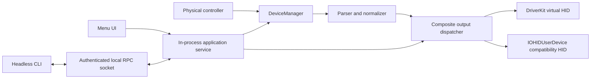

# Architecture

OpenJoystickDriver ships one application bundle and one user-facing process identity. The persistent LSUIElement main app owns the menu-bar UI, physical-controller pipeline, virtual-output dispatch, and authenticated local command endpoint.

## Process lifecycle

An interactive launch starts the main app and its runtime. Closing the popover does not stop controller processing. Choosing Quit stops the process.

On macOS 13 and later, `SMAppService.mainApp` registers the same app as a login item. There is no bundled helper, LaunchAgent plist, daemon executable, or second privacy identity. Migration removes obsolete alpha registrations and processes without resetting TCC.

Headless commands invoke the installed executable with `--headless`. Commands that need live state use a user-private Unix-domain socket at `/tmp/com.openjoystickdriver.<uid>.rpc`. The socket is mode `0600`; the server requires the same user, signing identifier, and team identifier. Frames and deadlines are bounded.

## Permissions

`OpenJoystickDriver.app` owns both required HID privacy decisions:

- Input Monitoring authorizes physical `IOHIDManager` and `IOHIDDevice` input.
- Accessibility, represented by `kIOHIDRequestTypePostEvent`, authorizes compatibility `IOHIDUserDevice` publication.

The application reports authoritative `IOHIDCheckAccess` results. Registration and `IOHIDRequestAccess` return values are not treated as grants. The DriverKit extension is a separate extension identity but is not a TCC input owner.

## Diagnostics

GUI process output is captured per launch under `~/Library/Logs/OpenJoystickDriver/`. Headless commands retain terminal output. Runtime health uses the authenticated socket PID rather than a launchd job. DriverKit diagnostics remain separate because the extension has its own lifecycle and registry state.
